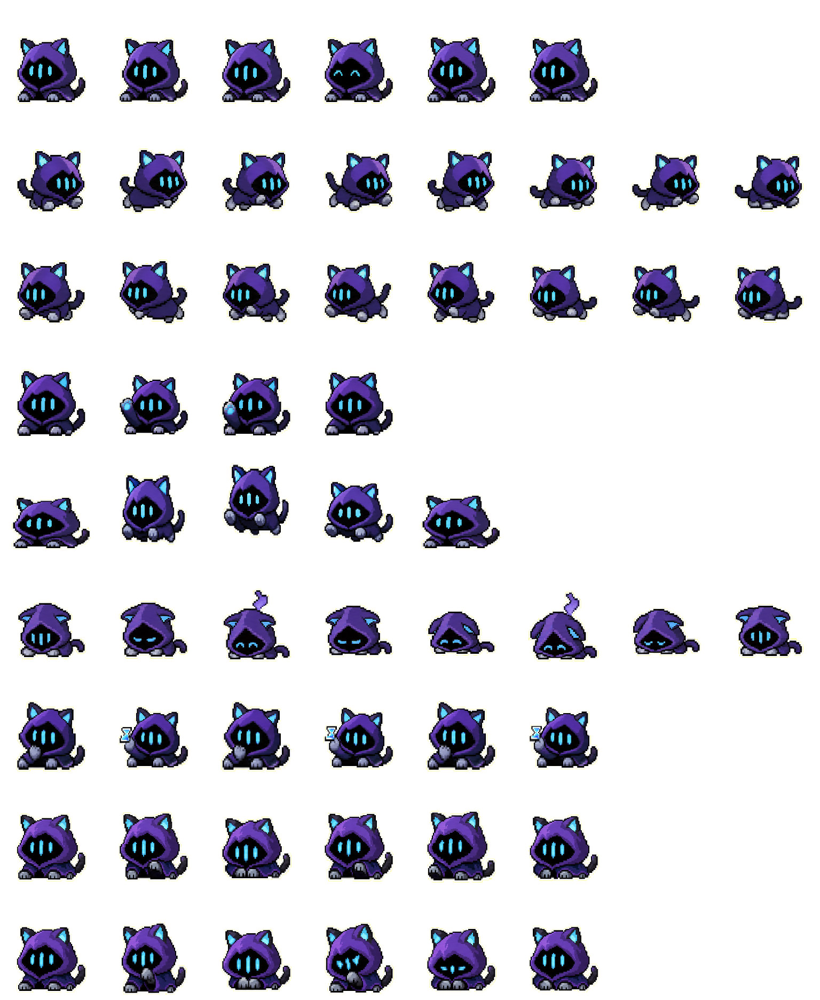

# 🐾 dsh-pet — DSH 桌面宠物

一只**全局置顶**的像素小猫，浮在你所有窗口之上，跟随 DSH agent 的工作状态自动切换动画与气泡——干活时卖力工作，问你问题时提醒你，完成时挥手庆祝。

> 灵感来自 [claude-pet](https://github.com/kweg5/claude-pet)（像素宠物开源项目）。


*默认形象：Valorant 幽影小猫（Omen Kitty）*

---

## ✨ 特性

| 能力 | 说明 |
|------|------|
| 🪟 **全局置顶** | Electron 透明置顶窗口，置顶级别 `screen-saver`（Windows 最高档），失焦自动重新置顶 |
| 📍 **自由拖动** | 按住左键拖动宠物，它会移动到任何位置，左右拖还会播放**向左走/向右走**动画 |
| 🎭 **状态联动** | 自动跟随 agent：工作中 / 查阅文件 / 写代码 / 等你确认 / 出错 / 完成，各有专属动画 |
| 💬 **气泡提示** | 工作时气泡**常驻**（"deep diving..."），提问/权限请求时提醒你"去 DSH 界面点选" |
| 📏 **档位缩放** | 右键菜单一键切换 20% ~ 200% 八档尺寸 |
| 🎨 **形象切换** | 内置两套形象：**欧门小猫（默认）** / **Claude 像素宠物**，右键菜单秒切 |
| 🖱️ **双击回 DSH** | 双击宠物立即把 DSH 主窗口调到最前 |
| 🏆 **完成反馈** | 任务/工作流完成时宠物挥手庆祝 |
| ✋ **点击穿透** | 默认不挡你点任何应用，鼠标移到宠物上才交互 |

---

## 📦 安装

### 依赖

- **DSH**（DeepSeek Harness，桌面版或 web 版）
- **dsh-super-injector**（运行时插件注入器，DSH 生态里的 `dev_*` 工具提供方）

### 方式一：注入器运行时注入（推荐，免重启）

在 DSH 会话里直接对 agent 说：

```
把 dsh-pet 注入进来
```

或调用注入器工具：

```bash
dev_inject_plugin {"dir": "<你 clone 下来的 dsh-pet 目录绝对路径>"}
```

### 方式二：作为 bundle 插件装配（重启后自动加载）

```bash
dsh plugin --profile <你的profile> add link:<你 clone 下来的 dsh-pet 目录绝对路径>
```

重启 DSH 后宠物自动出现。

> 注：当前只支持 **Windows**（依赖 Electron 透明窗口 + Windows 置顶级别 `screen-saver`）。

---

## 🖱️ 使用

| 操作 | 效果 |
|------|------|
| **按住左键拖动** | 移动宠物；水平拖动触发左右走动画，中途反方向拖立即切换 |
| **双击**（快速两击、几乎不移动） | 回到 DSH 主界面 + 挥手 |
| **右键** | 原生系统菜单：切换尺寸（8 档）/ 切换形象 / 隐藏·显示宠物 |
| **设置页开关** | DSH 设置页「🐾 桌面宠物」开关，随时关闭 |

窗口默认**点击穿透**，鼠标离开宠物时不挡你操作下方应用。

---

## 🎨 自定义皮肤

宠物精灵图是 **8 列 × 9 行** 的网格（单帧 192×208，整图 1536×1872 WebP）：

| 行 | 动画 | 有效帧数 |
|----|------|---------|
| row0 | 待机 idle | 6 |
| row1 | 向右走 run_r | 8 |
| row2 | 向左走 run_l | 8 |
| row3 | 挥手 wave | 4 |
| row4 | 跳跃 jump | 5 |
| row5 | 失败 failed | 8 |
| row6 | 等待 waiting | 6 |
| row7 | 工作 running/writing | 6 |
| row8 | 审查 review | 6 |

> ⚠️ **行末可能有多余的空白帧**：动画按每行**有效帧数**循环（见上面表格），自动跳过空白帧，不会闪现。自己换形象时，务必保证各行动画内容和上述行对应；如果新图行末有空白帧，请同步更新 `SKIN_ANIM_FRAMES`（`lib/pet.js` 中）中的有效帧数。
>
> 项目提供 `scripts/probe-frames.ps1`（逐帧统计 alpha 像素，找空白帧）和 `scripts/probe-anim-map.ps1`（验证左右行是否镜像），帮你检查新图。

---

## 🔧 开发者

### 项目结构

```
dsh-pet/
├── package.json              # 包名 dsh-pet；"type":"module"；main → lib/pet.js
├── lib/
│   ├── pet.js                # ⭐ Host 唯一入口：状态机 + 事件 + 窗口 + IPC + 原生菜单（SKIN_DEFS 在此）
│   ├── pet-window.html       # 全局宠物窗口产物（make-client.js 生成，内含精灵图）
│   ├── pet-window.template.html  # 窗口模板（__SPRITE_B64__ 占位，改窗口在这里改）
│   ├── client.js             # DSH 设置页开关（生成）
│   └── client.template.js    # client 模板
├── pet-preload.cjs           # ⭐ 窗口 preload（CommonJS，contextBridge 暴露 petBridge）
├── assets/
│   ├── spritesheet.webp      # 默认形象精灵图（Omen Kitty，VP8L 1536×1872）
│   ├── claude.webp           # 第二形象（Claude 像素宠物）
│   └── pet.json              # 精灵图元数据
├── scripts/
│   ├── make-client.js        # 生成 client.js + pet-window.html（改模板后必须重跑）
│   ├── probe-frames.ps1      # 逐帧空白帧分析工具
│   └── probe-anim-map.ps1    # 行映射/左右镜像验证工具
└── src/                      # TypeScript 参考实现（无构建链，实际产物是手写 JS）
```

### 构建

改 `lib/pet-window.template.html` 或 `client.template.js` 后运行：

```bash
node scripts/make-client.js
```

生成 `lib/pet-window.html` 与 `lib/client.js`。无其他构建链（手写产物形态，不依赖 tsc/tsdown）。

### 架构速览

```
窗口 HTML (pet-window.html)
  ⇅ petBridge（preload 暴露：onState/onSkin/click/action/dragging/draggingMove/requestSkin）
  ⇅ ipcRenderer.send / ipcMain.on（dsh-pet:* 通道）
  ⇅ Host (lib/pet.js)：状态机 + BrowserWindow + 原生 Menu + 文件读写
  ⇅ DSH 事件（agent/status、tools/*、approval/request、agent/error、workflow/*、subagent/*）
```

宠物状态由 Host **主动推送**（`webContents.send`），不做轮询。

---

## 🧠 已知的坑（开发者必读）

1. **preload 必须用 `.cjs`**：`package.json` 的 `"type":"module"` 会让 `.js` preload 被当 ESM → `require('electron')` 直接崩 → preload 静默不加载。必须用 `.cjs` 强制 CommonJS。
2. **preload 必须 `contextBridge.exposeInMainWorld('petBridge', ...)`**：`contextIsolation:true` 下直接 `window.petBridge=...` 写不进页面。
3. **preload 路径**：`pet.js` 在 `lib/`，preload 在根目录 → 要用 `new URL('../pet-preload.cjs', import.meta.url)`（`../` 不能写成 `./`）。
4. **置顶级别用 `screen-saver`**：`floating` 会被浏览器/视频窗口盖住；`screen-saver` 是 Windows 最高档置顶。失焦时 `blur` 事件里重新 `setAlwaysOnTop`（不抢焦点）。
5. **右键菜单必须用 Electron 原生 `Menu.popup`**：窗口内 HTML 菜单会被小窗口裁切（窗口宽 = 宠物尺寸），且点击穿透会让点外部不消失。
6. **窗口最小宽 400px**：透明窗口若按宠物尺寸，气泡文字会被横向裁剪。
7. **缩放用 `transform: scale`**：改元素尺寸会导致 background 错位、右下角残影。
8. **动画行末空白帧**：见上文「自定义皮肤」。
9. **拖动方向用「本次移动增量」判断**：不能用从按下点累计的位移（先左拖再右拖时会卡住不切换方向）。
10. **拖动流畅：渲染侧 rAF 合并 IPC + Host 直通 setPosition**：mousemove 可达 60~144Hz，直接每帧发 IPC 会拖不动。在窗口 HTML 用 `requestAnimationFrame` 合并（每帧最多发一次），Host 收到直接 `setPosition`，**不要**在 Host 用 `setTimeout` 节流（主进程忙时 setTimeout 实际延迟几十 ms，更卡）。

---

## 🧡 致谢

- 默认形象 Omen Kitty：源自 Codex 生态的像素宠物资源
- 灵感与网格规范：[claude-pet](https://github.com/kweg5/claude-pet)
- Claude 形象：claude-pixel 像素宠物

## 📄 License

[BSD-3-Clause](LICENSE)
